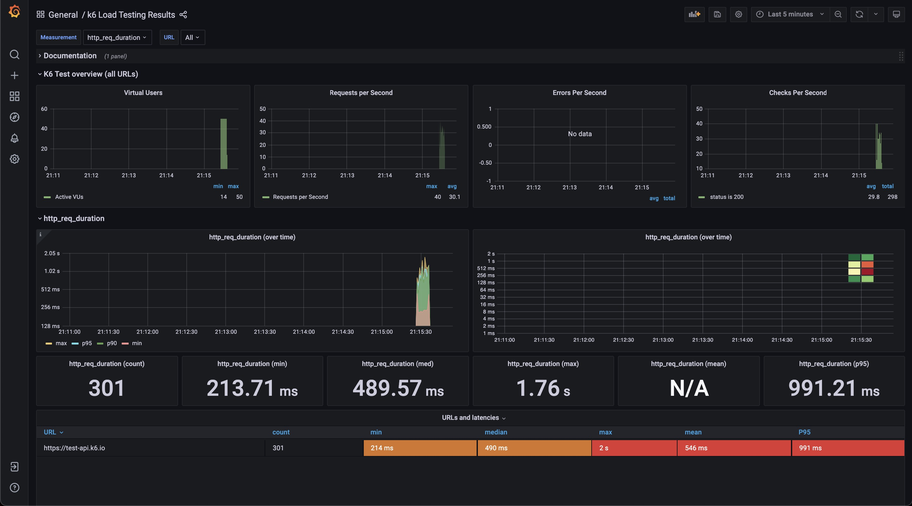

<div align="center">

  

# Alexander


</div>

This repository provides a scaffolding project to start using TypeScript in your k6 scripts.

## Rationale

## Prerequisites

- [docker](https://www.docker.com/get-started)
- [NodeJS](https://nodejs.org/en/download/)
- [Yarn](https://yarnpkg.com/getting-started/install) (optional)

## Installation

**Creating a project from the `template-typescript` template**

To generate a TypeScript project that includes the dependencies and initial configuration, navigate to the [template-typescript](https://github.com/k6io/template-typescript) page and click **Use this template**.

  


**Install dependencies**

Clone the generated repository on your local machine, move to the project root folder and install the dependencies defined in [`package.json`](./package.json)

```bash
$ yarn install
```

## Running the test

To run a test written in TypeScript, we first have to transpile the TypeScript code into JavaScript and bundle the project

```bash
$ yarn build
```

This command creates the final test files to the `./dist` folder.

Start InfluxDB and Grafana.

```bash
$ docker-compose up -d \
    influxdb \
    grafana
```

Once that is done, we can run our script the same way we usually do, for instance:

```bash
$ docker-compose run -v \
    $PWD/dist:/scripts \
    k6 run /scripts/test1.js
```

open http://localhost:3000


